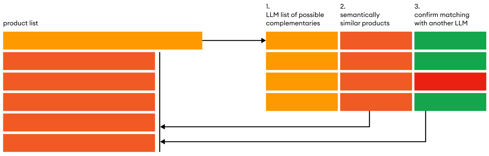

# Please cite
Algorithm: **zeroCPR**<br>
Author: **Michelangiolo Mazzeschi**<br>
Published: **2nd September 2024**

# zeroCPR
zeroCPR stands for **zero-shot Complementary Product Recommender framework**. <br> It is an open-source library designed to employ the power of LLMs to find complementaries given your complete product stock.

The zeroCPR framework can be outlined as follows, where we apply the following 3 steps for each product in our product list:



Following the creation of the complementar dataset, we can use the **Nearest Substitute Filling method** to account for the lack of data on a recommendation:


# supported API providers

- **[groq](https://groq.com/)**

# Running the engine

Refere to **notebooks/example_notebook.ipynb** for a working example.

```
from zeroCPR import engine

# initiate engine
myagent = engine.agent(groq_api_key='<your_api_key>')
```

The next step is inputting a list of products:

```
product_list = [
 'BLACK AND WHITE PAISLEY FLOWER MUG',
 'ASSORTED MINI MADRAS NOTEBOOK',
 'VICTORIAN METAL POSTCARD CHRISTMAS',
 'METAL SIGN EMPIRE TEA',
 'RED WALL CLOCK',
 'CRYSTAL KEY+LOCK PHONE CHARM',
 'MOTORING TISSUE BOX',
 'SILK PURSE RUSSIAN DOLL PINK',
 'VINTAGE SILVER TINSEL REEL',
 'RETRO SPOT TRADITIONAL TEAPOT',
...
```
### Encoding the list of products

The library uses the [sentence-transformers](https://github.com/UKPLab/sentence-transformers) to encode the list. You can run the following line of code **once**, and after saving the library somewhere you can **upload it back** (saving minutes/hours each time), or perhaps with your custom encoded data.

```
df_encoded = myagent.encode_products(product_list)
df_encoded.to_parquet('df_encoded.parquet', index=None)
```

if you already have an encoded dataset, in case you want to skip the encoding process every time you open up the notebook, upload encoded products from parquet to save time. The object should be a pandas datafrme with one column called **'raw'**, containing textual data, while the other column is called **'text_vector_'**, containing vectors.

```
df_encoded = pd.read_parquet('df_encoded.parquet')
myagent.upload_encoded_products(df_encoded)
```

### find complementaries of a single product

```
df_candidates, df_filtered = myagent.find_product_complementaries(['pizza'])
display(df_filtered)

#we can explore the comparison between complementary and similar products
print('complementary\t', df_filtered[df_filtered['score']==1]['recommended_product'].tolist())
print('similar\t\t', myagent.search_similar('pizza', k=len(df_filtered[df_filtered['score']==1])))
```

```
complementary	 ['CREAM SWEETHEART TRAYS', 'RED PUDDING SPOON', 'PIZZA DISH SLICE', 'PACK OF 20 SPACEBOY NAPKINS', 'SET/6 POSIES PAPER PLATES', 'S/16 VINTAGE BLACK CUTLERY', 'SET OF 2 ROUND TINS DUTCH CHEESE', 'JUMBO BAG STRAWBERRY', 'BREAD BIN, DINER STYLE, MINT']
similar		 ['PIZZA SLICE DISH', 'PIZZA DISH SLICE', 'PARTY PIZZA DISH BLUE POLKADOT', 'PARTY PIZZA DISH PINK POLKADOT', 'PARTY PIZZA DISH GREEN POLKADOT', 'PIZZA PLATE IN BOX', 'PARTY PIZZA DISH RED+WHITE SPOT', 'PARTY PIZZA DISH RED WHITE SPOT', 'PARTY PIZZA DISH PINK+WHITE SPOT']
```

### find the complementaries of k products

The core of the entire library is contained in this function. The code runs the previous function on a list (it could be 10, or even 1000 products), and builds a dataframe with all complementaries. 

The reason this function differs from the previous one **is not only that** it can take a list as input (otherwise we could have simply used a for cycle on the previous library).

```
# in this case, I am inputting 10 products as a test
df_complementaries = myagent.find_product_complementaries(product_list[50:60])

>>>
** SET 3 WICKER LOG BASKETS
** FUNKY GIRLZ ASST MAGNETIC MEMO PAD
** BLACK GEMSTONE BRACELET
ERR
** TOY TIDY PINK POLKADOT
** CROCHET WHITE RABBIT KEYRING
** MAGNETS PACK OF 4 HOME SWEET HOME
** POPCORN HOLDER , SMALL
** FLOWER BURST SILVER RING GREEN
** CRYSTAL DIAMANTE EXPANDABLE RING
** ASSORTED EASTER GIFT TAGS
```

Because we are dealing with a LLM, the process sometimes can fail: we cannot let this inconvenience break the code. The function is designed to run an iterative process of trial and error for each sample. As you can see from the output, when trying to find complementaries for **BLACK GEMSTONE BRACELET**, the first iteration was a fail (may have been because of a wrong parsing, or maybe a HTTPS request failure). 

The pipeline is designed to **try a maximum of 5 times** before giving up on a product and proceeding to the next one. Immediately at the end of this process, I am saving the output dataframe into a file.

### save output file

Don't forget to save your file once the process is completed.

```
df_complementaries.to_parquet('df_complementaries.parquet', index=None)
```
